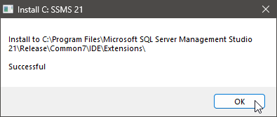

# SSMSExecutor Installer

Installers & Instructions for installing SSMS Executor

##	Background

Microsoft’s SQL Server Management Studio (SSMS) does a good job, but it lacks one tremendously useful feature: the ability to run a single statement at a time. (Sure, you can highlight the statement and run the selection, but who wants to do that multiple times?)

SSMS Executor ( [https://github.com/devvcat/ssms-executor](https://github.com/devvcat/ssms-executor) ) is a free addon which can be used to add this feature to SSMS.

Sadly, this addon hasn’t been updated for some time:

-	The original installer doesn’t work with newer versions of SSMS
-	The original addon no longer works with the SSMS version 21.

An updated version of SSMS is available from [https://github.com/tkwj/ssms-executor](https://github.com/tkwj/ssms-executor) .

When it comes to an updated installer, here it is.

Here are three methods to install SSMSExecutor, in order of convenience:

-	Run the SSMSExecutorInstaller application.

	If you can’t run the application, try this:

-	Run the SSMSExecutorInstaller batch script.

	If you can’t run the batch script, try this:

-	Copy the files manually.

##	SSMSExecutor Installer Application

Download the SSMSInstaller Application file: ( [https://github.com/manngo/ssms-executor-installer/releases/latest](https://github.com/manngo/ssms-executor-installer/releases/latest) | ssms-executor-installer.exe ).

Right-click on the installed application and select <kbd>Properties</kbd> …

Near the bottom of the <kbd>General</kbd> tab, select <kbd>Unblock</kbd> and <kbd>Apply</kbd>, then <kbd>OK</kbd>.

You can now double-click and start that application.

You _may_ get the following warning:

Select <kbd>More Info</kbd> and then <kbd>Run Anyway</kbd>.

You will then be asked for permission to go ahead:

Obviously, select <kbd>Yes</kbd>.

You’ll then see a choice of SSMS versions:

-	Any version of SSMS _not_ installed in your system will appear _with_ a question mark.
-	Any version of SSMS with SSMSExecutor already installed in your system will appear in __bold__.

Select any version(s) to install and click <kbd>OK</kbd>.

When the addon has been isntalled, you will see this message:

You can then <kbd>OK</kbd> and <kbd>Quit</kbd>.

##	SSMSExecutor Installer Batch Script

Download the SSMSInstaller Batch File zip file: ( [https://github.com/manngo/ssms-executor-installer/releases/latest](https://github.com/manngo/ssms-executor-installer/releases/latest) | ssms-executor-installer-bat.zip ).

_Before_ you unzip the file:

-	right-click on the installed application and select <kbd>Properties</kbd> …

	

-	Near the bottom of the General tab, select <kbd>Unblock</kbd> and <kbd>Apply</kbd>, then <kbd>OK</kbd>.

To extract the contents of the zip file, either:

-	double-click on the zip file and drag the contents to some convenient location.
-	right-click on the folder and extract all.

Again:

-	Right-click on the batch file and select <kbd>Properties</kbd> …

-	Near the bottom of the General tab, select <kbd>Unblock</kbd> and <kbd>Apply</kbd>, then <kbd>OK</kbd>.

##	SSMSExecutor Installer Copy Folder

If all else fails, you can try to copy the addon manually,

First, follow the instructions above to download and unzip the `ssms-executor-installer-bat.zip` file.

Inside the folder you’ll see two folders:

-	`SSMSExecutorNew` for SSMS 21
-	`SSMSExecutorOld` for SSMS 17, 18, 19 and 20

Copy the appropariate folder to one of these locations:

| Version | Folder          | Location                                                                                   |
|---------|-----------------|--------------------------------------------------------------------------------------------|
| SSMS 21 | SSMSExecutorNew | C:\Program Files\Microsoft SQL Server Management Studio 21\Release\Common7\IDE\Extensions\ |
| SSMS 20 | SSMSExecutorOld | C:\Program Files (x86)\Microsoft SQL Server Management Studio 20\Common7\IDE\Extensions\   |
| SSMS 19 | SSMSExecutorOld | C:\Program Files (x86)\Microsoft SQL Server Management Studio 19\Common7\IDE\Extensions\   |
| SSMS 18 | SSMSExecutorOld | C:\Program Files (x86)\Microsoft SQL Server Management Studio 18\Common7\IDE\Extensions\   |
| SSMS 17 | SSMSExecutorOld | C:\Program Files (x86)\Microsoft SQL Server\140\Tools\Binn\ManagementStudio\Extensions\    |

You can rename the folder to `SSMSExecutor`.
